# AIMart 白皮书（战术版草案）

> **以 AI 为客户的基础设施级交易平台**  
> 版本：v0.2  
> 日期：2026-06-06  
> 状态：战略与实施草案  
> 适用对象：创始团队、产品团队、技术团队、运营团队、潜在合伙人、投资人、首批商家与生态合作方  

---

## 封面

# AIMart

## 以 AI 为客户的基础设施级交易平台

### 让 AI 自己发现能力、比较能力、购买能力、组合能力、调用能力，并反馈效果。

---

### 核心主张

> **AIMart 不是 AI 工具导航站，不是模型公司，不是单一 Agent 开发商。  
> AIMart 是 AI 能力交易基础设施。**

我们相信，下一代市场不只是“人逛的市场”，而是 **AI Agent 也能逛、能读、能买、能调用、能结算、能评价的市场**。

人类电商解决的是：

```text
人如何购买商品。
```

AIMart 要解决的是：

```text
AI 如何购买能力。
```

---

### 一句话定位

> **AIMart 是一个面向 AI Agent 与人类企业的能力交易平台，让模型、技能、专家、算力、API、工作流和行业方案像商品一样流通。**

---

### 战略口号

```text
让 AI 能力像商品一样流通。
让 AI Agent 像买家一样采购能力。
让商家像开店一样出售 AI 能力。
```

---

### 本白皮书解决的问题

1. 为什么需要一个 AI 逛的市场？
2. AIMart 到底是什么，不是什么？
3. AIMart 上交易的商品是什么？
4. AI 如何搜索、比较、试用、购买和调用能力？
5. 如何设计 AgentCard 能力描述标准？
6. 如何设计预算、授权、支付、结算和担保交易？
7. 如何建立信任、评测、履约和反馈体系？
8. 平台如何冷启动？
9. MVP 怎么做？
10. 技术路线、商业模式和运营体系如何落地？

---

## 目录

- [AIMart 白皮书（战术版草案）](#aimart-白皮书战术版草案)
  - [封面](#封面)
  - [目录](#目录)
  - [0. 执行摘要](#0-执行摘要)
  - [1. 为什么要建一个 AI 逛的市场](#1-为什么要建一个-ai-逛的市场)
  - [2. AIMart 定义：平台不做产品，只做 AI 世界的交易基础设施](#2-aimart-定义平台不做产品只做-ai-世界的交易基础设施)
  - [3. 市场机会与商业可行性](#3-市场机会与商业可行性)
  - [4. 参与者网络：不要限定客户，而要定义角色](#4-参与者网络不要限定客户而要定义角色)
  - [5. 商品体系：从模型市场升级为能力市场](#5-商品体系从模型市场升级为能力市场)
  - [6. AgentCard：AI 可读能力声明标准](#6-agentcardai-可读能力声明标准)
  - [7. AI 如何逛市场：从意图到结算的自动化流程](#7-ai-如何逛市场从意图到结算的自动化流程)
  - [8. 七层协议栈：支撑 AIMart 的基础设施架构](#8-七层协议栈支撑-aimart-的基础设施架构)
  - [9. AI 支付体系：谁来付、怎么付、付多少](#9-ai-支付体系谁来付怎么付付多少)
  - [10. 信任、评测与履约体系](#10-信任评测与履约体系)
  - [11. 商业模式设计](#11-商业模式设计)
  - [12. 运营逻辑：商家带流量，平台沉淀交易](#12-运营逻辑商家带流量平台沉淀交易)
  - [13. 技术架构设计](#13-技术架构设计)
  - [14. MVP 路线图](#14-mvp-路线图)
  - [15. 12 个月技术路线图](#15-12-个月技术路线图)
  - [16. 冷启动策略](#16-冷启动策略)
  - [17. 风险、合规与治理](#17-风险合规与治理)
  - [18. 竞争格局与 AIMart 的差异化](#18-竞争格局与-aimart-的差异化)
  - [19. 关键指标体系](#19-关键指标体系)
  - [20. 战术执行清单](#20-战术执行清单)
  - [21. 最终结论](#21-最终结论)
  - [附录 A：AgentCard 示例](#附录-aagentcard-示例)
  - [附录 B：API 示例](#附录-bapi-示例)
  - [附录 C：术语表](#附录-c术语表)
  - [附录 D：参考资料](#附录-d参考资料)

---

# 0. 执行摘要

## 0.1 核心判断

互联网正在发生一次新的范式迁移。

过去的市场是给人看的：

```text
人类打开网页
人类搜索商品
人类比较价格
人类下单支付
人类评价服务
```

未来的市场会逐渐变成 AI 也能参与：

```text
AI Agent 接收任务
AI Agent 自动搜索能力
AI Agent 比较价格、质量、延迟、安全、权限
AI Agent 申请预算授权
AI Agent 下单调用能力
AI Agent 组合多个能力完成任务
AI Agent 回传效果数据
```

这意味着，未来的“市场”不只是 UI、货架和广告，而是：

```text
能力描述协议
AI 搜索协议
预算授权协议
支付结算协议
履约验收协议
效果反馈协议
风险治理协议
```

AIMart 要做的不是 AI 产品，而是 **AI 能力交易基础设施**。

---

## 0.2 AIMart 要解决的核心矛盾

AI Agent 正在变得越来越能做事，但它们缺少一个专门为它们设计的市场。

当前市场存在三个根本问题：

```text
1. 商品描述是写给人看的，不是写给 AI 读的。
2. 交易流程是人类点击式的，不适合 AI 自动采购。
3. 支付、授权、履约、评价体系没有为机器买家设计。
```

这导致 AI Agent 即使有任务，也很难安全、可控、可审计地采购外部能力。

---

## 0.3 AIMart 的解决方案

AIMart 提供一个完整闭环：

```text
能力上架
→ AgentCard 标准化描述
→ AI 搜索与匹配
→ 试用沙箱
→ 报价与预算
→ 授权与支付
→ 调用与履约
→ 评价与反馈
→ 评分与推荐优化
```

---

## 0.4 平台三类入口

AIMart 不是只服务某一类客户，而是一个多边网络：

| 入口 | 角色 | 价值 |
|---|---|---|
| 商家入口 | AI 服务商、模型方、Agent 开发者、专家、算力商 | 开店、上架、交易、交付、收款 |
| 人类买家入口 | 企业、团队、个人 AI 使用者 | 找能力、买方案、控风险、验收效果 |
| AI Agent 入口 | 企业 Agent、个人 Agent、第三方 Agent | 自动搜索、比较、调用、组合、反馈 |

核心原则是：

> **战略上不限定客户；执行上先跑通能力交易闭环。**

---

## 0.5 近期落地方式

不要先做一个大而全空平台。

先做：

```text
商家开店工具
能力商品标准
需求发布系统
报价系统
担保交易
交付里程碑
评价系统
AI 可读能力卡片
能力搜索 API
```

早期利用商家自带客户和平台人工撮合跑通交易。  
中期让 AI Agent 参与搜索、推荐和报价。  
长期让 AI Agent 在预算和权限范围内自动采购和调用能力。

---

# 1. 为什么要建一个 AI 逛的市场

## 1.1 电商进化史：三次范式迁移

电商不是一次性出现的，而是伴随技术基础设施不断演进。

### 第一次迁移：网页购物，货架数字化

时间大约在 2000 年代。

核心变化：

```text
线下货架 → 线上货架
纸质目录 → 网页商品页
电话下单 → 网页下单
```

这一阶段解决的是：

> 商品如何搬到互联网上。

代表能力：

```text
商品页
搜索框
购物车
在线订单
物流追踪
```

### 第二次迁移：移动支付，交易即时化

时间大约在 2010 年代。

核心变化：

```text
PC 购物 → 手机购物
网银支付 → 移动支付
搜索购买 → 推荐购买
```

这一阶段解决的是：

> 交易如何更快、更便捷、更随时随地发生。

代表能力：

```text
移动 App
扫码支付
推荐算法
即时客服
社交分发
直播带货
```

### 第三次迁移：代理型商务，决策自动化

时间大约从 2025-2026 年以后开始加速。

核心变化：

```text
人类自己搜索 → AI 帮人搜索
人类自己比较 → AI 自动比较
人类自己下单 → AI 代表人或企业下单
人类使用工具 → AI 调用能力完成任务
```

这一阶段解决的是：

> 当 AI Agent 成为行动主体之后，市场如何为 AI 服务。

---

## 1.2 范式迁移图示

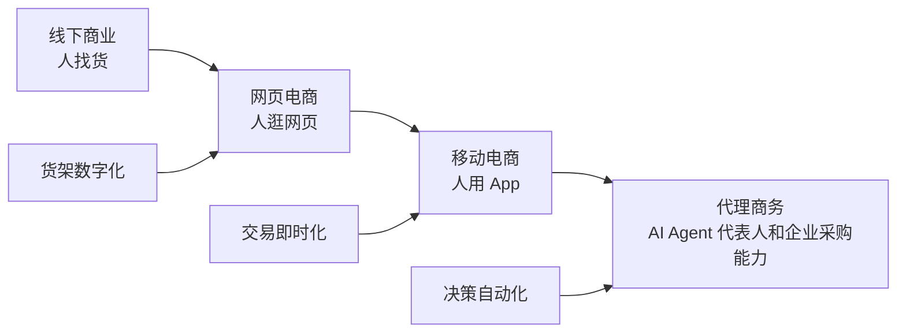

---

## 1.3 被忽视的新买家：AI Agent

过去平台默认买家是人。

但未来会出现一类新的高频买家：

```text
企业内部 Agent
个人助理 Agent
开发者构建的工作流 Agent
SaaS 内嵌 Agent
行业 Agent
采购 Agent
客服 Agent
销售 Agent
数据分析 Agent
运维 Agent
```

这些 Agent 会不断遇到外部能力不足的问题。

例如：

```text
它缺少 OCR 能力，需要购买 OCR API。
它缺少法律知识，需要调用法律专家 Agent。
它缺少算力，需要租 GPU。
它缺少行业工作流，需要购买某个自动化技能。
它需要完成一个复杂任务，需要组合多个能力。
```

所以未来的交易不只是：

```text
人买工具。
```

而是：

```text
AI 买能力。
```

---

## 1.4 现有平台为什么不够

现有 AI 平台大多仍是“人逛的”。

它们通常具备：

```text
网页 UI
自然语言介绍
人工搜索
人工选择
人工复制 API Key
人工付款
人工评价
```

但缺少面向 AI Agent 的核心能力：

```text
机器可读商品描述
结构化输入输出 Schema
自动能力搜索 API
预算与权限控制
试用沙箱
自动化微支付
Agent 身份体系
结构化效果反馈
能力组合协议
```

所以它们更像：

```text
AI 资源展示平台
```

而不是：

```text
AI 能力交易基础设施
```

---

## 1.5 核心机会

AIMart 要抓住的不是“AI 工具很多”的机会，而是：

> **当 AI Agent 成为买家后，谁来为它提供可信、可读、可交易、可调用、可结算的能力市场。**

这才是基础设施级机会。

---

# 2. AIMart 定义：平台不做产品，只做 AI 世界的交易基础设施

## 2.1 AIMart 是什么

AIMart 是一个 AI 能力交易平台。

它让以下供给方可以像开店一样出售能力：

```text
模型提供方
Agent 开发者
技能/Workflow 开发者
Prompt 工程师
AI 专家
行业顾问
算力供应商
数据服务商
SaaS 厂商
系统集成商
安全与评测服务商
```

它让以下买家可以购买能力：

```text
AI Agent
企业客户
个人 AI 使用者
开发者
团队
SaaS 平台
自动化工作流系统
```

---

## 2.2 AIMart 不是什么

AIMart 不是：

```text
不是模型公司
不是单一 Agent 开发商
不是 AI 工具导航站
不是单纯外包平台
不是单纯算力市场
不是单一行业解决方案公司
不是只服务工厂、电商或某一类客户的垂直平台
```

AIMart 是：

```text
能力商品化平台
AI 可读市场
交易履约平台
Agent 采购网关
能力结算网络
信任评测系统
```

---

## 2.3 与淘宝、京东、云市场的类比

| 平台形态 | 交易对象 | 买家 | 平台核心 |
|---|---|---|---|
| 淘宝 | 实物商品 | 人 | 店铺、搜索、支付、评价 |
| 京东 | 商品 + 履约 | 人 | 供应链、质控、物流、售后 |
| 云市场 | 软件/API/云服务 | 企业/开发者 | 软件上架、云端部署、企业采购 |
| AIMart | AI 能力 | AI Agent + 人类 | 能力描述、AI 搜索、交易、调用、结算、反馈 |

AIMart 的关键不是“像淘宝一样展示很多商品”，而是：

> **把 AI 能力变成可被 AI 购买和调用的标准商品。**

---

## 2.4 AIMart 的核心闭环

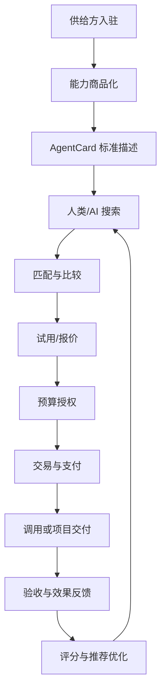

---

## 2.5 战略开放，规则硬化

AIMart 不应限定行业、客户或能力类型。

但必须限定平台规则。

### 不限定

```text
不限定客户
不限定行业
不限定商家类型
不限定能力形态
不限定流量来源
```

### 必须限定

```text
能力如何描述
能力如何上架
能力如何搜索
能力如何比较
能力如何报价
能力如何交易
能力如何履约
能力如何验收
能力如何评价
能力如何被 AI Agent 读取和调用
```

这就是 AIMart 的基本战略：

> **开放供给，统一规则。**

---

# 3. 市场机会与商业可行性

## 3.1 市场机会不是单一市场，而是多市场交汇

AIMart 的机会不是来自一个单一行业，而是多个市场的交叉：

```text
AI Agent 市场
模型/API 市场
云与算力市场
企业 AI 服务市场
专家服务市场
Agentic Commerce 市场
M2M 支付市场
企业自动化市场
```

它们共同指向一个趋势：

> AI 会越来越多地代表人和企业执行任务，执行任务就需要调用外部能力，调用能力就需要交易、结算、权限、信任和评价。

---

## 3.2 公开市场数据参考

不同研究机构对市场规模的口径差异较大，因此本白皮书不把某一个数字当作唯一依据，而是把这些数据作为趋势验证。

### AI Agent 市场

MarketsandMarkets 预计 AI Agents 市场从 2025 年约 78.4 亿美元增长到 2030 年约 526.2 亿美元，CAGR 约 46.3%。[R10]

Precedence Research 另一口径预计全球 AI agents 市场从 2025 年约 79.2 亿美元增长到 2035 年约 2946.6 亿美元，2026-2035 年 CAGR 约 43.57%。[R11]

这说明 AI Agent 不是单一应用，而是一个高速增长的能力基础层。

### Agentic Commerce 市场

Mordor Intelligence 估算，agentic AI in retail and eCommerce 市场 2025 年约 467.4 亿美元，2026 年约 604.3 亿美元，并预计 2031 年约 2183.7 亿美元。[R8]

Morgan Stanley 预计，到 2030 年，agentic shoppers 可能带来美国电商支出中 1900 亿到 3850 亿美元的影响，对应 10%-20% 的份额。[R9]

### AI Agent 流量变化

Human Security 观察到，2025 年前 8 个月 agentic traffic 增长超过 1300%。[R12]

这说明 AI Agent 不只是“概念”，而是已经开始作为网络访问主体出现。

### 风险提醒

Gartner 曾预测，到 2027 年底，超过 40% 的 agentic AI 项目可能因成本、商业价值不清晰或风险控制不足而被取消。[R13]

这提醒我们：

> AIMart 不能只讲自动化愿景，必须提供信任、权限、预算、验收和治理基础设施。

---

## 3.3 AIMart 的市场空间判断

AIMart 的市场空间来自四类交易。

| 交易类型 | 说明 | 早期可行性 | 长期潜力 |
|---|---|---:|---:|
| AI 服务/方案交易 | 专家、服务商、方案包 | 高 | 高 |
| API/Agent 调用交易 | OCR、RAG、客服、数据分析等 | 中 | 极高 |
| 算力与部署交易 | GPU、推理端点、私有化部署 | 中 | 高 |
| Agent 自动采购交易 | AI Agent 自主选择和调用能力 | 低中 | 极高 |

早期最适合从：

```text
商家开店 + AI 服务/方案交易 + 部分 API 调用
```

开始。

长期演进到：

```text
Agent 自动采购 + M2M 微支付 + 多能力组合执行
```

---

## 3.4 AIMart 的商业机会图示

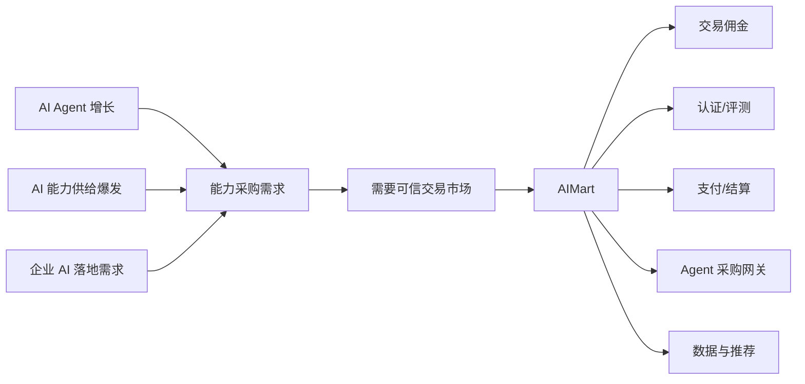

---

# 4. 参与者网络：不要限定客户，而要定义角色

## 4.1 平台不是单边市场

AIMart 不是简单“卖家对买家”。

它是一个多边网络。

```text
供给方
人类买家
AI Agent 买家
渠道方
平台治理方
支付/结算方
评测/安全方
```

---

## 4.2 角色图示

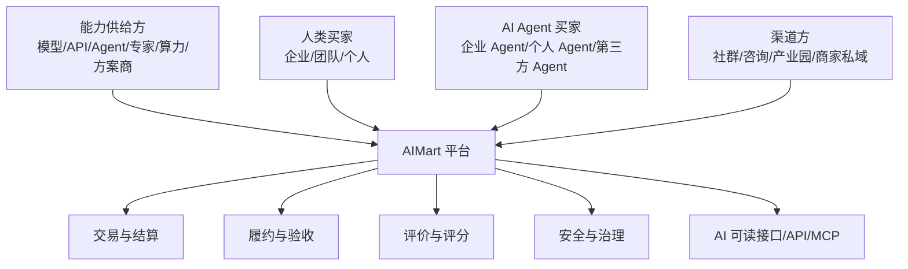

---

## 4.3 能力供给方

供给方包括：

```text
模型公司
开源模型团队
Agent 开发者
AI 服务商
系统集成商
行业专家
SaaS 厂商
Prompt/Workflow 开发者
数据服务团队
算力/部署服务商
评测与安全团队
```

他们的核心需求不是单纯曝光，而是：

```text
获客
开店
能力包装
报价
担保交易
项目管理
收款
复购
评价沉淀
降低销售成本
接入 AI Agent 采购渠道
```

---

## 4.4 人类买家

人类买家包括：

```text
企业
工厂
电商团队
内容团队
个人 AI 使用者
创业团队
咨询公司
学校
政府/园区
开发者
```

他们的核心需求是：

```text
找靠谱能力
知道该买什么
比较方案
降低试错成本
保障交付
控制预算
保护数据
验收效果
```

---

## 4.5 AI Agent 买家

AI Agent 是未来高频买家。

它们的需求是：

```text
搜索能力
读取能力卡片
理解输入输出
比较价格、延迟、质量、安全
请求报价
申请预算授权
调用能力
组合能力
提交反馈
```

---

## 4.6 渠道方

渠道方包括：

```text
商家私域
行业协会
产业园区
自媒体
培训机构
咨询公司
企业服务渠道
SaaS 生态
地方数字化服务机构
```

AIMart 应该允许渠道方参与分佣。  
这让平台早期不完全依赖自有流量。

---

# 5. 商品体系：从模型市场升级为能力市场

## 5.1 为什么不是只卖模型

客户和 Agent 真正需要的是“完成任务的能力”，不是单个模型。

例如：

```text
我要合同审查能力。
我要客服自动回复能力。
我要企业知识库能力。
我要商品图批量生成能力。
我要销售线索分析能力。
我要 GPU 推理扩容能力。
```

这些能力可能由多个要素组成：

```text
模型 + Agent + 工具 + 数据 + 专家 + 算力 + 工作流 + 评测 + 交付
```

所以 AIMart 的商品不是“AI 产品”，而是：

> **可交易的 AI 能力单元。**

---

## 5.2 AIMart 商品分类

### 四类核心商品

| 商品类型 | 交付方式 | 定价模型 | 买家需求场景 |
|---|---|---|---|
| 模型 | API 调用、权重授权、私有部署 | 按 Token、按次、授权费 | 推理能力不足时升级 |
| 技能 | Agent、代码包、配置文件、Workflow | 按次、订阅、买断 | 缺少某领域能力时加装 |
| 专家 | 咨询、知识库、微调、审核规则 | 按小时、项目制、Token | 遇到专业问题时咨询 |
| 算力 | GPU 实例、推理端点、部署环境 | 按时、按量、包月 | 本地资源不足时扩容 |

### 扩展商品

| 商品类型 | 说明 | 为什么重要 |
|---|---|---|
| 方案包 | 面向业务问题的组合交付 | 适合企业买家 |
| 数据服务 | 清洗、标注、解析、知识库处理 | AI 落地前置能力 |
| 评测服务 | 模型评测、Agent 测试、红队测试 | 建立信任 |
| 安全服务 | 权限、审计、合规、数据隔离 | 企业采购必要 |
| 工作流模板 | 自动化流程、Prompt 模板 | 容易规模化 |
| MCP Server / Tool | 可被 Agent 调用的工具服务 | AI 原生能力入口 |

---

## 5.3 商品从“人类商品页”到“机器能力声明”

传统商品页包含：

```text
标题
图片
价格
规格
评价
售后
```

AIMart 商品必须增加：

```text
输入 Schema
输出 Schema
能力边界
调用方式
价格模型
权限需求
数据政策
风险等级
可组合关系
SLA
评测结果
真实使用反馈
```

---

## 5.4 商品体系图示

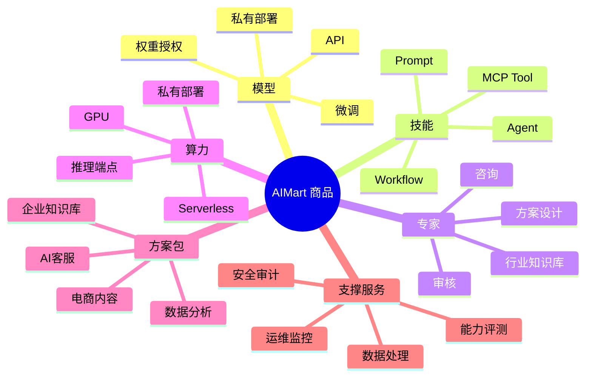

---

# 6. AgentCard：AI 可读能力声明标准

## 6.1 AgentCard 是 AIMart 的核心资产

AgentCard 是能力商品的机器可读描述。

它类似普通电商里的商品详情页，但更结构化、更适合 AI 读取。

AgentCard 的目标：

```text
让 AI 知道这个能力是什么。
让 AI 知道什么时候该用它。
让 AI 知道怎么调用它。
让 AI 知道它要多少钱。
让 AI 知道它有什么风险。
让 AI 知道效果如何评价。
```

---

## 6.2 AgentCard 的设计原则

```text
机器可读
人类可理解
可搜索
可比较
可调用
可计费
可评测
可追责
可版本化
可扩展
```

---

## 6.3 AgentCard 核心字段

```yaml
agentcard_version: "0.1"
capability_id: "cap_knowledge_rag_001"
name: "企业知识库问答 Agent"
type: "agent"
category: "knowledge_management"
seller_id: "seller_001"
version: "1.0.0"

human_description: >
  适合企业将制度、产品文档、SOP、FAQ 转化为可问答的 AI 助手。

machine_description: >
  This capability answers questions based on uploaded enterprise documents
  using retrieval augmented generation and citation-based responses.

use_cases:
  - "企业制度问答"
  - "产品资料问答"
  - "SOP 查询"
  - "新人培训助手"

not_suitable_for:
  - "医疗诊断"
  - "法律最终意见"
  - "高风险自动决策"

input_schema:
  type: object
  required:
    - question
    - knowledge_base_id
  properties:
    question:
      type: string
    knowledge_base_id:
      type: string
    user_role:
      type: string

output_schema:
  type: object
  properties:
    answer:
      type: string
    citations:
      type: array
    confidence:
      type: number
    need_human_review:
      type: boolean

execution:
  modes:
    - api
    - private_deployment
    - project_delivery
  protocol:
    - REST
    - MCP
  endpoint: "https://api.aimart.example/capabilities/cap_knowledge_rag_001/run"

pricing:
  model: "usage_based"
  unit: "request"
  price: 0.02
  currency: "CNY"
  trial_supported: true
  trial_limit: "100 requests"

sla:
  average_latency_ms: 1500
  uptime_target: "99.5%"
  support_response_time: "24h"

permissions:
  data_required:
    - "enterprise_documents"
    - "user_question"
  external_write_permission: false
  payment_permission_required: false
  human_approval_required: false

data_policy:
  store_user_data: false
  use_data_for_training: false
  retention_days: 0
  private_deployment_supported: true
  data_deletion_supported: true

risk:
  risk_level: "medium"
  sensitive_data_involved: true
  regulated_industry: false
  requires_human_review: false

evaluation:
  platform_score: 4.6
  task_success_rate: 0.91
  refund_rate: 0.03
  average_rating: 4.7
  sample_size: 1280

composability:
  can_chain_with:
    - "document_parser"
    - "ocr_service"
    - "enterprise_wechat_connector"
  dependencies:
    - "knowledge_base_setup"

settlement:
  settlement_mode: "prepaid_balance"
  escrow_supported: true
  micropayment_supported: true
```

---

## 6.4 AgentCard 与 A2A Agent Card 的关系

Google A2A 协议中也提出 Agent Card，用于让 Agent 发现其他 Agent 的能力。[R6]

AIMart 可以借鉴这个思想，但需要扩展为 **交易型 AgentCard**。

A2A Agent Card 偏重：

```text
能力发现
Agent 连接
任务通信
```

AIMart AgentCard 需要额外包含：

```text
价格
支付
退款
SLA
数据政策
风险等级
验收标准
评价指标
商家信息
结算规则
```

也就是说：

> **A2A Agent Card 是协作名片，AIMart AgentCard 是可交易能力商品卡。**

---

# 7. AI 如何逛市场：从意图到结算的自动化流程

## 7.1 AI 逛市场的完整流程

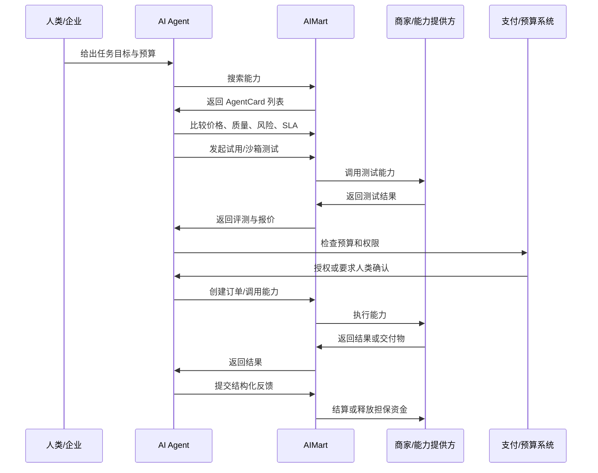

---

## 7.2 五个关键动作

AI Agent 在 AIMart 中的核心动作是：

```text
1. Search：搜索能力
2. Compare：比较能力
3. Try：试用能力
4. Buy：购买或发起订单
5. Execute：调用或组合执行
6. Feedback：反馈效果
```

---

## 7.3 试用沙箱机制

AI 不应该只看商家描述就下单。

平台必须提供试用沙箱。

### 沙箱目的

```text
验证输出质量
验证延迟
验证格式
验证调用稳定性
验证风险边界
验证数据处理方式
```

### 沙箱类型

| 沙箱类型 | 适合商品 | 说明 |
|---|---|---|
| 免费样例沙箱 | API、Agent、模型 | 使用平台样例数据测试 |
| 买家数据沙箱 | RAG、数据分析、文档处理 | 使用脱敏数据测试 |
| 任务模拟沙箱 | 工作流、Agent 组合 | 模拟完整任务 |
| 安全沙箱 | MCP Tool、外部写入能力 | 限制权限，检查风险 |

---

## 7.4 AI 决策依据

AI Agent 不应该只按价格排序，而应综合：

```text
任务匹配度
价格
调用成本
延迟
成功率
商家信誉
平台评分
风险等级
数据政策
是否支持私有化
是否可组合
是否支持退款
历史失败原因
```

---

# 8. 七层协议栈：支撑 AIMart 的基础设施架构

## 8.1 为什么需要协议栈

AI 逛市场不是简单访问网页。

它需要一套协议栈支持：

```text
连接
发现
描述
搜索
试用
交易
支付
协作
履约
反馈
治理
```

---

## 8.2 AIMart 七层协议栈

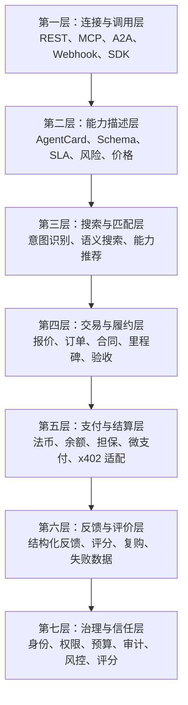

---

## 8.3 与现有协议的关系

| 协议/标准 | 作用 | AIMart 使用方式 |
|---|---|---|
| MCP | AI 应用连接外部工具、数据源和工作流 | 作为能力调用和工具接入层 |
| A2A | Agent 与 Agent 之间通信、协作、能力发现 | 作为 Agent 协作与能力发现参考 |
| ACP | AI Agent 与商家之间完成购买流程 | 作为交易流程与商家系统兼容参考 |
| x402 | HTTP 402 驱动的机器对机器微支付 | 作为未来高频微支付适配方向 |
| AP2 / UCP | Agent 支付与完整商务旅程相关协议 | 作为长期兼容方向，早期预留 |

---

## 8.4 技术判断

短期不需要完全实现所有协议。

应该采用：

```text
内部统一能力模型
外部兼容主流协议
关键数据结构自主掌控
```

也就是说：

```text
AgentCard 是 AIMart 的核心标准。
MCP/A2A/ACP/x402 是外部兼容层。
```

---

# 9. AI 支付体系：谁来付、怎么付、付多少

## 9.1 AI 支付的本质问题

AI Agent 不是法律主体。

它花的钱属于：

```text
个人用户
企业账户
项目预算
部门预算
预充值钱包
平台授信额度
```

所以核心不是“AI 自己有钱”，而是：

> **人类或企业授权 AI 在预算范围内消费。**

---

## 9.2 预算池模型

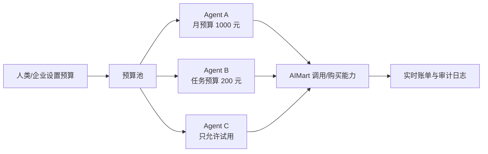

---

## 9.3 分层授权模型

| 金额/风险 | 权限规则 | 示例 |
|---|---|---|
| 免费/试用 | Agent 可自主执行 | 试用 10 次 OCR |
| 微额 | Agent 可在预算内自动消费 | 每次 0.001-0.01 元 API 调用 |
| 小额 | 可自动消费，但需日报/周报 | 每次 0.01-1 元 |
| 中额 | 需要人类确认或预授权 | 100-1000 元订单 |
| 大额 | 必须人工审批 | 项目制方案、私有化部署 |
| 高风险 | 必须人工审批 + 审计 | 法律、金融、医疗、高敏数据 |

白皮书里可以用示例金额，但实际产品要按市场、币种和风险调整。

---

## 9.4 三种结算方式

### 方式一：法币结算

适合：

```text
企业项目
专家服务
方案包
订阅商品
私有化部署
```

特点：

```text
适合合规场景
便于开票
适合大额交易
需要支付渠道与担保交易
```

### 方式二：平台余额 / 预充值

适合：

```text
API 调用
小额 Agent 消费
企业部门预算
```

特点：

```text
可实时扣费
便于预算控制
便于账单归集
```

### 方式三：M2M 微支付协议

适合未来：

```text
机器对机器高频调用
跨平台 Agent 调用
开放 API 经济
```

x402 使用 HTTP 402 Payment Required 作为支付触发机制，目标是让 AI agents 和 web services 能自主为 API、数据和数字服务付费。[R4][R5]

AIMart 短期不用直接押注单一协议，但应预留微支付抽象层。

---

## 9.5 担保交易

对于项目制和方案包，AIMart 应采用担保交易：

```text
买家付款到平台
商家按里程碑交付
买家验收
平台分阶段释放资金
争议时冻结资金并仲裁
```

这解决 AI 能力交易中的核心信任问题：

```text
买家怕商家交付不了
商家怕买家拒付
平台需要沉淀真实交易数据
```

---

# 10. 信任、评测与履约体系

## 10.1 为什么信任是核心

AI 能力不像普通商品。

普通商品：

```text
看图、看评价、收货、退货
```

AI 能力：

```text
效果不稳定
场景依赖强
数据质量影响大
交付边界复杂
责任难界定
风险难预测
```

所以 AIMart 必须把信任做成基础设施。

---

## 10.2 信任体系结构

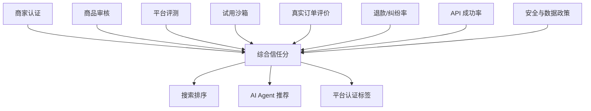

---

## 10.3 三类评价

### 人类评价

```text
交付质量
沟通效率
准时交付
售后服务
性价比
是否愿意复购
```

### AI Agent 结构化评价

```json
{
  "success": true,
  "task_match_score": 0.92,
  "latency_ms": 1300,
  "cost": 0.02,
  "output_schema_valid": true,
  "needs_human_review": false,
  "failure_reason": null
}
```

### 平台评测

```text
标准测试集
沙箱运行结果
安全检测
接口稳定性
人工复核
案例真实性
```

---

## 10.4 履约机制

不同商品对应不同履约方式。

| 商品类型 | 履约方式 | 验收方式 |
|---|---|---|
| API | 调用成功即履约 | 成功率、返回格式、延迟 |
| Agent | 任务执行 | 任务完成率、输出质量 |
| 专家服务 | 里程碑交付 | 文档、会议、方案、系统 |
| 方案包 | 项目制履约 | 测试用例、上线验收 |
| 算力 | 资源可用 | GPU 可用率、时长、性能 |
| 工作流 | 流程执行 | 端到端任务成功率 |

---

# 11. 商业模式设计

## 11.1 收入结构

AIMart 不靠单一收入。

### 交易佣金

```text
项目制服务佣金
方案包佣金
API 调用分成
订阅分成
算力租赁分成
```

### 增值服务

```text
商家认证
商品评测
安全审计
沙箱试用
案例认证
高级店铺
商家经营工具
```

### 基础设施服务

```text
API 托管
Agent Gateway
支付结算
企业采购网关
私有市场部署
权限与审计系统
```

### 数据服务

```text
市场洞察
能力推荐
价格建议
类目分析
商家经营分析
行业趋势报告
```

---

## 11.2 商家自带客户低佣金策略

早期商家会解决一部分引流问题。

所以平台不能对商家自带客户收太高佣金，否则商家会绕开平台。

建议：

| 来源 | 佣金建议 |
|---|---:|
| 商家自带客户 | 3%-8% |
| 渠道导入客户 | 5%-12% |
| 平台撮合客户 | 10%-20% |
| API 高频调用 | 5%-15% |
| 认证/评测服务 | 固定费或年费 |

核心逻辑：

> 平台对自带客户收“交易基础设施费”，对平台撮合客户收“市场佣金”。

---

## 11.3 长期商业模型

AIMart 最终不只是收佣金。

长期收入应来自：

```text
AI Agent 采购网关
能力路由费
M2M 结算费
企业私有市场
商家 SaaS 工具
风险与合规服务
能力评测标准
数据洞察服务
```

---

# 12. 运营逻辑：商家带流量，平台沉淀交易

## 12.1 早期冷启动的关键

传统平台冷启动难点：

```text
没有买家，商家不来。
没有商家，买家不来。
```

AIMart 可以用商家带流量破局：

```text
商家已有客户
商家已有案例
商家已有服务能力
平台帮助商家标准化交易和履约
商家愿意把客户带进平台成交
```

---

## 12.2 商家为什么愿意来

平台必须给商家实际价值：

```text
能力商品化
标准商品页
AI 需求表单
报价模板
担保交易
里程碑管理
评价沉淀
客户管理
续费管理
平台认证
未来 AI Agent 自动发现
```

如果平台只提供曝光，早期吸引力不足。

如果平台提供交易工具和信任背书，商家会愿意试用。

---

## 12.3 商家运营飞轮

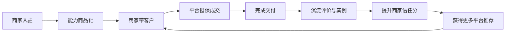

---

## 12.4 平台运营重点

早期运营不应追求海量商家，而应追求：

```text
高质量商家
真实客户
真实订单
真实评价
真实失败数据
真实复购
```

推荐第一阶段目标：

```text
20-50 个认证商家
50-100 个能力商品
10-30 个真实需求
5-20 个真实订单
3-5 个标杆案例
```

---

# 13. 技术架构设计

## 13.1 总体架构图

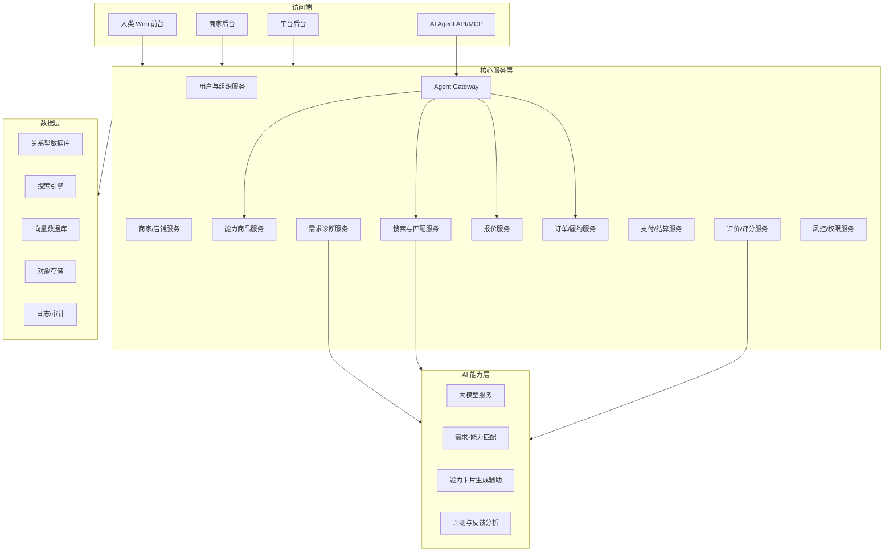

---

## 13.2 核心系统模块

### 买家端

```text
首页
搜索
商品详情
商家店铺
需求发布
需求诊断
报价列表
订单详情
验收评价
企业中心
Agent 权限管理
```

### 商家端

```text
入驻申请
店铺管理
商品管理
AgentCard 编辑器
线索管理
报价管理
订单交付
里程碑
评价
结算
经营数据
```

### 平台端

```text
商家审核
商品审核
类目管理
需求池
撮合管理
订单监管
结算管理
纠纷处理
评价审核
风险监控
数据看板
```

### AI Agent 端

```text
能力搜索 API
能力详情 API
能力比较 API
报价请求 API
订单草案 API
调用执行 API
反馈提交 API
权限与预算 API
```

---

## 13.3 数据模型核心对象

```text
User
Organization
AgentIdentity
Seller
Store
Capability
AgentCard
Requirement
Quote
Order
Milestone
Execution
Payment
Settlement
Review
Dispute
Channel
RiskEvent
```

---

# 14. MVP 路线图

## 14.1 MVP 目标

MVP 不追求完整自动化，而是验证：

```text
商家能上架
客户能进来
需求能结构化
商家能报价
平台能担保交易
项目能履约
评价能沉淀
AI 能读取能力
```

---

## 14.2 0-30 天：设计与验证

### 目标

完成战略、商品标准和首批供需验证。

### 动作

```text
确定一句话定位
完成 AgentCard v0.1
完成 5 类商品模板
访谈 20 个商家
访谈 20 个潜在买家
整理 50 个潜在商家名单
整理 30 个潜在渠道名单
完成 MVP 原型
完成订单流程图
完成佣金规则草案
```

### 输出

```text
白皮书 v0.2
AgentCard 规范
商品模板
商家入驻表
需求发布表
MVP 原型
首批商家名单
```

---

## 14.3 31-60 天：MVP 开发与商家入驻

### 目标

让商家可以开店、上架、接需求、报价。

### 必做功能

```text
商家入驻
店铺管理
能力商品上架
AgentCard 编辑器
买家需求发布
平台后台审核
报价功能
基础搜索
```

### 目标指标

```text
20-50 个商家意向
50-100 个能力商品
10 个真实需求
3 个报价试点
```

---

## 14.4 61-90 天：交易闭环测试

### 目标

跑通真实订单。

### 必做功能

```text
订单系统
担保交易雏形
交付里程碑
验收确认
评价系统
能力搜索 API v0.1
```

### 目标指标

```text
5-20 个真实订单
3-5 个可展示案例
能力卡片完整率 80%+
订单完成率 70%+
纠纷率可控
```

---

## 14.5 91-180 天：半自动化与 Agent 接口

### 目标

从人工撮合升级为半自动匹配和 AI 可读市场。

### 必做功能

```text
语义搜索
需求诊断器
AI 推荐商家
Agent API v0.1
企业预算与权限
渠道分佣
商家经营数据
API 调用计费
```

---

# 15. 12 个月技术路线图

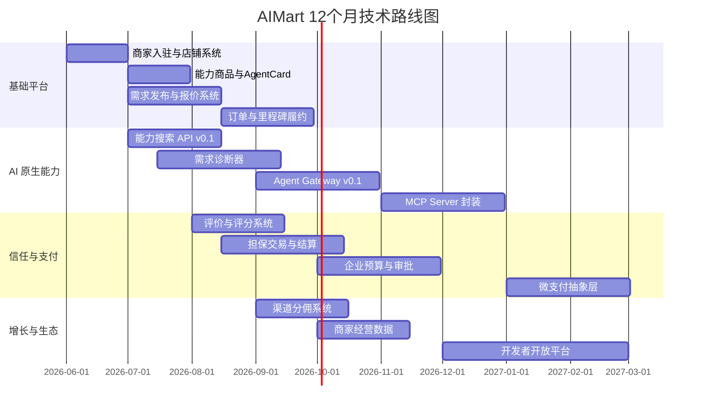

---

# 16. 冷启动策略

## 16.1 不用“限定行业”冷启动，而用“交易闭环”冷启动

我们不应该把平台战略限制成某一个行业。

但早期要选择最容易跑通交易闭环的商品类型。

推荐首批类目不是“行业限定”，而是“能力类型优先”：

```text
企业知识库/RAG
AI 客服/销售助手
文档处理/OCR/摘要
电商内容生成
AI 自动化工作流
AI 专家服务/私有化部署
API 能力
```

这些能力可以服务多个行业。

---

## 16.2 首批供给方策略

```text
邀请制
精选制
平台协助包装商品
低佣金试点
认证标签
商家自带客户优惠佣金
```

首批目标：

```text
20-50 个高质量商家
每个商家至少 1-3 个能力商品
总计 50-100 个能力商品
```

---

## 16.3 首批买家策略

买家来源：

```text
商家自带客户
平台免费需求诊断
渠道合作
行业社群
内容获客
创始团队人脉
```

---

## 16.4 渠道策略

渠道方可以是：

```text
产业园
企业服务公司
培训机构
咨询顾问
AI 社群
行业协会
SaaS 服务商
```

给渠道方提供：

```text
专属链接
线索归因
成交分佣
渠道后台
联合活动
```

---

# 17. 风险、合规与治理

## 17.1 主要风险

| 风险 | 描述 | 应对 |
|---|---|---|
| 商家绕开平台 | 商家将客户导向私下交易 | 低佣金、自带客户优惠、平台担保、评价沉淀 |
| 商品质量不稳定 | AI 能力效果依赖场景 | 审核、试用沙箱、评价、退款机制 |
| AI 自动支付风险 | Agent 被诱导消费 | 预算上限、权限分层、人工审批 |
| 数据泄露 | 客户资料被滥用 | 数据政策、代理调用、私有化、日志审计 |
| 高风险行业责任 | 法律、医疗、金融等输出错误 | 风险分级、人工复核、禁用自动化 |
| 虚假宣传 | 商家夸大效果 | 商品审核、案例认证、处罚机制 |
| 评价作弊 | 刷单刷评 | 真实交易评价、反作弊、权重控制 |
| Prompt Injection | AI 被恶意内容操控 | 沙箱、工具白名单、输出过滤、审计 |

---

## 17.2 风险等级

```text
低风险：文案、摘要、格式转换、图片处理
中风险：客服、知识库、销售、数据分析
高风险：法律、医疗、金融、招聘、风控
禁止类：违法、诈骗、攻击、隐私窃取、恶意爬虫
```

---

## 17.3 Agent 权限分级

| 等级 | 权限 | 说明 |
|---|---|---|
| L0 | 只读公开能力 | 搜索、读取 AgentCard |
| L1 | 比较与推荐 | 生成采购建议 |
| L2 | 发起报价 | 不产生支付 |
| L3 | 创建订单草案 | 需要人类确认 |
| L4 | 小额自动调用 | 企业预授权 |
| L5 | 高风险/大额 | 必须人工审批 |

---

## 17.4 安全设计原则

```text
默认最小权限
所有 Agent 有身份
所有调用可审计
所有支付有预算
高风险动作人工审批
外部工具默认不可信
商家能力先经过平台网关
数据政策必须透明
```

---

# 18. 竞争格局与 AIMart 的差异化

## 18.1 现有平台类型

| 类型 | 代表 | 优势 | 局限 |
|---|---|---|---|
| 模型社区 | Hugging Face、ModelScope | 模型资源多 | 主要给人/开发者看，不是完整交易履约平台 |
| Agent 商店 | GPTs、插件市场 | 上手简单 | 多依赖单一生态 |
| 云市场 | AWS、阿里云、Azure Marketplace | 企业采购强 | 偏云生态，不一定 AI Agent-first |
| API 市场 | RapidAPI 类 | API 调用清晰 | 缺少专家/方案/履约 |
| 服务外包平台 | Upwork、Fiverr、猪八戒 | 人力服务丰富 | 不够 AI 原生，不适合 Agent 自动采购 |
| MCP Registry | MCP 工具注册 | 连接能力强 | 缺少支付、交易、评价和担保 |

---

## 18.2 AIMart 差异化

AIMart 不是靠“商品更多”取胜，而靠以下能力：

```text
AI 可读 AgentCard
Agent 搜索与匹配
预算授权与支付
担保交易与履约
试用沙箱
结构化反馈
跨类型能力交易
商家经营工具
AI Agent 采购网关
真实交易数据驱动评分
```

---

## 18.3 核心护城河

```text
能力描述标准
高质量商家池
真实交易数据
真实效果反馈
Agent 访问接口
支付与结算网络
信任与评测体系
商家经营工具
企业预算与权限系统
```

---

# 19. 关键指标体系

## 19.1 供给侧指标

```text
入驻商家数
认证商家数
有效能力商品数
AgentCard 完整率
API 可调用能力比例
商家活跃率
商家自带客户数
```

## 19.2 需求侧指标

```text
需求发布数
有效需求率
需求到报价转化率
报价到订单转化率
平均客单价
复购率
```

## 19.3 交易指标

```text
GMV
佣金收入
订单数量
订单完成率
退款率
纠纷率
平均交付周期
```

## 19.4 AI 原生指标

```text
AgentCard 可读率
AI 搜索调用次数
AI 搜索成功率
Agent 发起报价次数
Agent 推荐被采纳率
API 调用成功率
结构化反馈覆盖率
```

## 19.5 信任指标

```text
平台认证商品占比
试用沙箱覆盖率
交付成功率
客户满意度
商家评分
商品评分
安全事件数
高风险拦截数
```

---

# 20. 战术执行清单

## 20.1 本周完成

```text
1. 确定 AIMart 一句话定位
2. 完成 AgentCard v0.1
3. 做 5 个商品模板
4. 做商家入驻表
5. 做需求发布表
6. 列 50 个潜在商家
7. 列 30 个潜在渠道
8. 画 MVP 页面草图
9. 设计报价和订单流程
10. 确定自带客户佣金规则
```

## 20.2 10 天内完成

```text
1. 访谈 10 个商家
2. 访谈 10 个买家
3. 让 5 个商家试填 AgentCard
4. 形成 20 个能力商品样例
5. 形成 3 个需求诊断样例
6. 完成 MVP 低保真原型
```

## 20.3 30 天内完成

```text
1. 20 个商家意向入驻
2. 50 个商品样例
3. 10 条真实客户需求
4. 3 个报价撮合试点
5. 1 套平台规则草案
6. 1 个可演示 MVP
```

---

# 21. 最终结论

AIMart 的机会不是做一个“AI 工具大全”，也不是做一个“模型列表”。

真正的机会是：

> **当 AI Agent 成为新的买家，市场必须从人类 UI 货架升级为机器可读、可交易、可调用、可结算、可评价的能力基础设施。**

AIMart 的战略是：

```text
不限定客户
不限定行业
不限定能力类型
不限定流量来源
```

但执行上必须坚持：

```text
统一能力标准
统一交易闭环
统一信任评价
统一支付授权
统一安全治理
统一 AI 可读接口
```

最终愿景：

> **AIMart 让 AI 自己逛市场，让商家出售能力，让人类设定目标和边界，让平台负责交易、履约、信任、结算和治理。**

最短总结：

```text
淘宝让商品流通。
云市场让软件流通。
AIMart 让 AI 能力流通。
```

---

# 附录 A：AgentCard 示例

```yaml
agentcard_version: "0.1"
capability_id: "cap_ecommerce_copywriter_001"
name: "电商商品文案生成 Agent"
type: "agent"
category: "content_generation"
seller_id: "seller_ai_content_001"
version: "1.0.0"

human_description: "为电商商家生成标题、卖点、详情页文案和社媒种草文案。"
machine_description: "Generate ecommerce product copy based on product attributes, target platform, tone and audience."

input_schema:
  type: object
  required:
    - product_name
    - product_attributes
    - target_platform
  properties:
    product_name:
      type: string
    product_attributes:
      type: object
    target_platform:
      type: string
      enum:
        - taobao
        - tmall
        - pinduoduo
        - xiaohongshu
        - douyin
    tone:
      type: string

output_schema:
  type: object
  properties:
    title:
      type: string
    selling_points:
      type: array
    long_description:
      type: string
    social_post:
      type: string

pricing:
  model: "usage_based"
  unit: "request"
  price: 0.05
  currency: "CNY"

execution:
  modes:
    - api
    - web
  protocol:
    - REST

risk:
  risk_level: "low"
  requires_human_review: false

evaluation:
  platform_score: 4.5
  task_success_rate: 0.88
  average_rating: 4.6
```

---

# 附录 B：API 示例

## B.1 搜索能力

```http
GET /api/v1/capabilities/search?q=电商文案生成&risk_level=low
```

返回：

```json
{
  "query": "电商文案生成",
  "results": [
    {
      "capability_id": "cap_ecommerce_copywriter_001",
      "name": "电商商品文案生成 Agent",
      "type": "agent",
      "starting_price": 0.05,
      "pricing_model": "usage_based",
      "platform_score": 4.5,
      "risk_level": "low",
      "execution_modes": ["api", "web"]
    }
  ]
}
```

## B.2 获取能力详情

```http
GET /api/v1/capabilities/cap_ecommerce_copywriter_001
```

返回完整 AgentCard。

## B.3 发起报价请求

```http
POST /api/v1/quotes/request
```

请求：

```json
{
  "requirement_id": "req_001",
  "capability_ids": ["cap_001", "cap_002"],
  "buyer_budget": "5000-10000 CNY",
  "message": "请根据需求提供方案和报价"
}
```

## B.4 提交结构化反馈

```http
POST /api/v1/feedback
```

请求：

```json
{
  "execution_id": "exec_001",
  "capability_id": "cap_ecommerce_copywriter_001",
  "success": true,
  "task_match_score": 0.9,
  "latency_ms": 1200,
  "cost": 0.05,
  "comments": "输出格式正确，内容需少量人工修改"
}
```

---

# 附录 C：术语表

| 术语 | 说明 |
|---|---|
| AI Agent | 能代表人或系统执行任务的 AI 实体 |
| Agentic Commerce | 由 AI Agent 参与发现、决策、购买和交易的商务形态 |
| AgentCard | AIMart 定义的机器可读能力商品卡 |
| MCP | Model Context Protocol，AI 应用连接外部工具和数据源的开放协议 |
| A2A | Agent2Agent，Agent 间通信与协作协议 |
| ACP | Agentic Commerce Protocol，OpenAI 和 Stripe 推动的代理商务协议 |
| x402 | 使用 HTTP 402 机制支持机器对机器微支付的协议 |
| M2M Payment | Machine-to-Machine Payment，机器对机器自动结算 |
| 能力商品 | 可被人类或 AI Agent 购买、调用、交付和评价的 AI 能力 |
| 试用沙箱 | 在受控环境中测试能力效果和安全性的机制 |
| 担保交易 | 平台暂存资金，验收后分阶段结算给商家的交易机制 |

---

# 附录 D：参考资料

> 注：以下资料用于校准趋势、协议与市场数据。市场规模口径因研究机构定义不同存在差异，正式融资材料或对外发布版本需要进一步核验与统一口径。

[R1] Model Context Protocol 官方文档：What is MCP?  
https://modelcontextprotocol.io/docs/getting-started/intro

[R2] OpenAI：Buy it in ChatGPT: Instant Checkout and the Agentic Commerce Protocol  
https://openai.com/index/buy-it-in-chatgpt/

[R3] Stripe：Developing an open standard for agentic commerce  
https://stripe.com/blog/developing-an-open-standard-for-agentic-commerce

[R4] x402 Whitepaper  
https://www.x402.org/x402-whitepaper.pdf

[R5] Stripe x402 payments documentation  
https://docs.stripe.com/payments/machine/x402

[R6] Google Developers Blog：Announcing the Agent2Agent Protocol  
https://developers.googleblog.com/en/a2a-a-new-era-of-agent-interoperability/

[R7] Google / AP2 相关新闻与公开报道  
https://www.axios.com/2025/09/16/google-ai-agents-ecommerce-online-shopping

[R8] Mordor Intelligence：Agentic AI in Retail and eCommerce Market  
https://www.mordorintelligence.com/industry-reports/agentic-artificial-intelligence-in-retail-and-ecommerce-market

[R9] Morgan Stanley：Agentic Commerce Impact Could Reach $385 Billion by 2030  
https://www.morganstanley.com/insights/articles/agentic-commerce-market-impact-outlook

[R10] MarketsandMarkets：AI Agents Market  
https://www.marketsandmarkets.com/Market-Reports/ai-agents-market-15761548.html

[R11] Precedence Research：AI Agents Market  
https://www.precedenceresearch.com/ai-agents-market

[R12] Human Security：Examining AI Agent Traffic  
https://www.humansecurity.com/learn/blog/ai-agent-statistics-agentic-commerce/

[R13] Reuters：Over 40% of agentic AI projects will be scrapped by 2027, Gartner says  
https://www.reuters.com/business/over-40-agentic-ai-projects-will-be-scrapped-by-2027-gartner-says-2025-06-25/

[R14] Reuters：Citigroup lifts AI market view to over $4 trillion on enterprise adoption  
https://www.reuters.com/business/finance/citigroup-lifts-ai-market-view-over-4-trillion-enterprise-adoption-2026-04-28/
